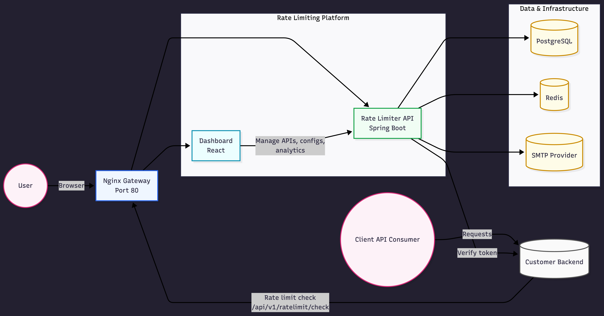

# Rate Limiter (Self-Hosted)

A modern, self-hosted rate limiting platform with a clean dashboard, API key management, verified backend ownership, rate-limit configuration by endpoint, and analytics. Built for solo developers and small teams who want full control over infrastructure without giving up a great UX.

## Who This Is For

- Solo developers who want a production-ready rate limiting service they can run locally or on a server.
- Small teams that want a lightweight internal platform with ownership verification, API keys, and analytics.

## What You Get

- Dashboard UI for endpoints, configs, API keys, and analytics
- Ownership verification via a `/.well-known` route on your backend
- Configurable rate limiting per endpoint (single active config per endpoint)
- Nuke testing tool to validate limits under load
- Detailed analytics (request timeline, top endpoints)

## Architecture



## Quick Start (Docker, recommended)

Prerequisites:
- Docker + Docker Compose

Steps:
1. Copy the environment file:
   ```bash
   cp .env.example .env
   ```
2. Fill in the required values in `.env`:
   - `DATABASE_URL`, `DATABASE_USERNAME`, `DATABASE_PASSWORD`
   - `JWT_SECRET`
   - `MAIL_USERNAME`, `MAIL_PASSWORD` (SMTP)
3. Launch the stack:
   ```bash
   ./launch-services.sh up
   ```

Access:
- Dashboard: http://localhost
- Backend API: http://localhost/api/v1
- Health: http://localhost/actuator/health

## Auth Mode (Solo vs Standard)

Configure in `.env`:
- `AUTH_MODE=solo` for single-admin login
- `AUTH_MODE=standard` for email + OTP signup

Solo mode requires:
- `ADMIN_EMAIL`
- `ADMIN_PASSWORD`

Note: In solo mode, sign-up is disabled and the login page is labeled "Admin Login."

## Setup Guide (Owner Verification + Rate Limiting)

### 1) Create an API Key
- Open the dashboard and go to **API**.
- Create a key and copy it (shown once).

### 2) Add the verification route to your backend
Expose a route on your backend:
```
GET /.well-known/ratelimiter-verify?token=YOUR_TOKEN
```
Return the token as plain text.

### 3) Add your backend in Dashboard
- Go to **Backend Links**.
- Add your backend URL and click **Verify**.

### 4) Create endpoints
- Go to **Endpoints** and add each route you want to rate limit.

### 5) Configure rate limits
- Add one active config per endpoint.
- Choose an algorithm or recommended defaults.

### 6) Add the rate limit check in your backend
Call the rate limiter before handling requests:
```
POST /api/v1/ratelimit/check
Headers:
  X-API-Key: <YOUR_API_KEY>
Body:
  { "endpoint": "/path", "method": "GET" }
```
If the response is `429`, return it to the client.

## Analytics

The dashboard includes:
- Request timeline (allowed vs blocked)
- Top endpoints by volume
- Block rate summary

Use these to validate configurations and spot hot paths.

## Nuke Test

Open an endpoint and run a nuke test to simulate load. The test logs results and updates analytics so you can verify behavior under pressure.

## Monitoring

Start the main stack plus the monitoring overlay:

```bash
docker compose -f docker-compose.yml -f docker-compose.monitoring.yml up -d
```

Access:
- Grafana: http://localhost:3001 (default: `admin` / `admin`)
- Prometheus: http://localhost:9090

Dashboard panels:
- HTTP req/s by endpoint: request throughput broken down by endpoint/URI labels.
- p95/p99 latency: 95th and 99th percentile latency for `POST /api/v1/ratelimit/check`.
- JVM heap: JVM heap used vs max memory to monitor pressure and headroom.
- Rate-limit allow vs deny ratio: real-time allowed vs denied share for rate-limit checks.

## Project Structure

```
rate-lim/
  dashboard/        # React dashboard
  ratelimiter/      # Spring Boot API
  nginx-gateway/    # Single entry point (port 80)
  docker-compose.yml
  launch-services.sh
```

## Notes

- This repo is designed for **self-hosting**. You control your DB, Redis, SMTP, and JWT secrets.
- `.env` should never be committed. Keep secrets private.

---

If this repo saves you time, consider starring it. It helps a lot.
